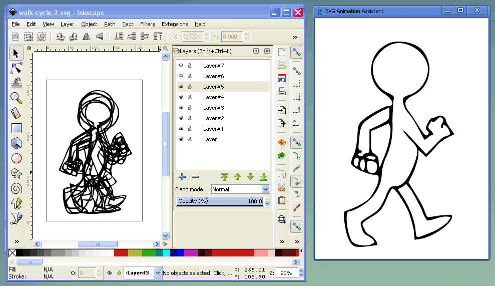
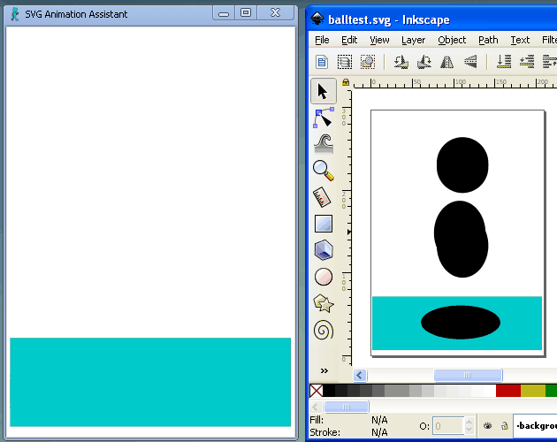
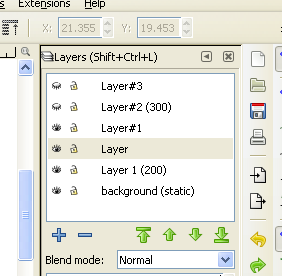

Quickly and easily animate Inkscape SVGs.

[Buy the Windows program at itch.io](https://thebusiness.itch.io/svg-animation-assistant)

This tool will cycle through the layers of your SVG allowing you to do basic flip-book style animation. Each layer in your SVG is one frame of the animation.

The animation live-reloads in the assistant window whenever you hit save in Inkscape.

Easily customise frame timing and behaviour by editing the layer name:

 * Set the number of milliseconds to pause on each frame by entering a number in brackets in the layer name like (100) for a pause of 1/10th of a second.
 * Add static background frames by putting (static) in the layer name.

### Run on Linux

If you are a Linux user you can [use the online version of this app](https://chr15m.github.io/svg-animation-assistant).
